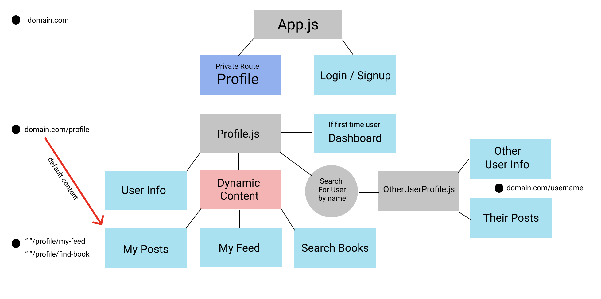

# Think-Ewe: PERN app
Think-Ewe (pronounced "think you") is my first attempt at my own version of a social network app, with the theme of books! Kind of like a "goodreads.com" lite. Nevertheless, I made this app because I thought there were a few areas that could be improved when it comes to tracking you and your friend's favorite books. With think-ewe I tried to make the UI/UX more indicative a standard social network like twitter or instagram, something I find lacking in other book tracking apps. Another inspiration for making this app was to get rid of the 5 star rating system, and replace it with a 3 star system. 1 star === 'good read', 2 stars === 'great read', and 3 stars is an exceptional read. The premise being that a 3 star system makes it much easier to tell if a book is worth reading or not. 

## Technologies Used
- React client
- Node Express server
- PostgreSQL database
- Sequelize ORM
- Material UI for styling
- Google Books API
- Heroku deployment

### Check it out here --> https://think-ewe.herokuapp.com

## App Wire-frame

## Database erd
